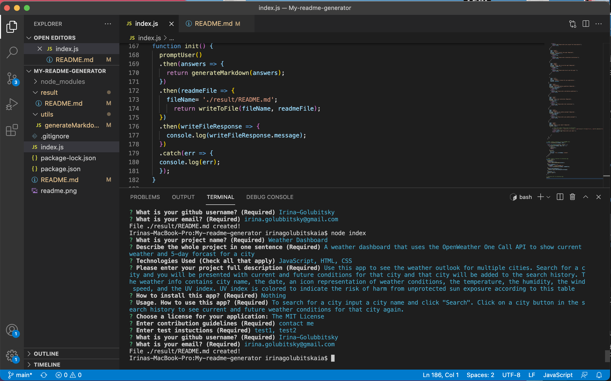

# My-readme-generator [](https://opensource.org/licenses/MIT)
An app to generate a README file by using a command-line 
## Technologies Used

* JavaScript (Node.js)

## Description 

A command-line application that dynamically generates a professional README.md file from a user's input using the Inquirer package. Generated README file contains title of the project and sections entitled Description, Table of Contents, Installation, Usage, License, Contributing, Tests, and Questions. when user choose a license for his/her application from a list of options then a badge for that license is added near the top of the README and a notice is added to the section of the README entitled License that explains which license the application is covered under.

## Table of Contents 
--- 
- [Installation](#installation)
- [Usage](#usage)
- [License](#license)
- [Demo](#demo)
- [Screenshot](#screenshot)
- [Questoins](#quedestions)
  
## Installation 
  ---
   ``` 
    npm init
    npm install inquirer
   ```
  
## Usage
  ---
  Run the following command in a terminal at the root of this project 
   ```
    node index.js
   ```
   Then, answer propted questions.
## License 
  ---
  
  The MIT License

## Demo
  ---
  
  jfie  

## Screenshot
  ---
  
  |  
   
## Questions
  ---
  If you hane any questions:
  
  Get in touch with me on Github [Irina-Golubitsky](https://github.com/Irina-Golubitsky)
  
  Email me irina.golubitsky@gmail.com

